# **Build a Skittle Classifier Workflow with AWS Step Functions**  

In this workshop you’ll create a serverless pipeline that:  

- Receives notifications when an image is uploaded.  
- Runs Lambdas to classify Skittles and (optionally) generate an image.  
- Publishes results to a robot via SNS.  

This guide is structured step by step. Each step builds on the previous one.  

---

## Create the Step Function

- In the AWS Console, open **Step Functions**
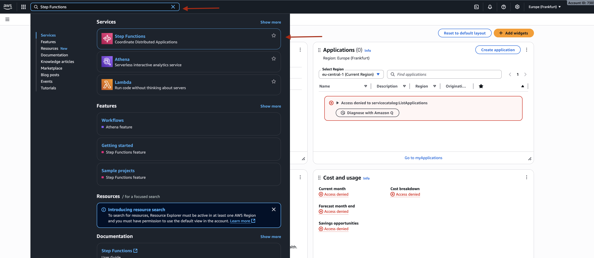
- Click on `Create state machine` in the top right corner
  - Give it a **unique name** so you can identify your own resources (important since everyone shares the same account).
  - For the type select `Standard`
  - Then click on `Continue`
  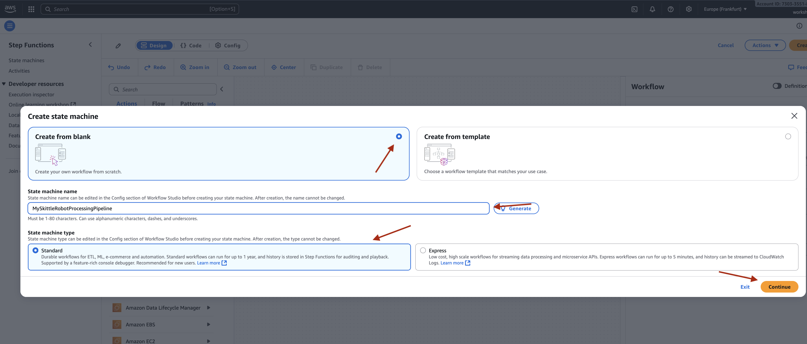

- Add a **Pass** state:  
  - In the left panel under **Flow**, drag **Pass** between **Start** and **End**.  
  - Rename it to **Init**.  

   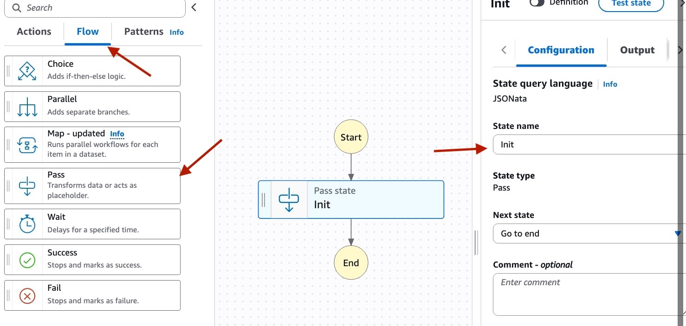

  - Select the **Init** state → **Variables** tab → paste:  

     ```json
     {
       "participantId": "set your participant id here",
       "imageGenerationUploadBucketArn": "communitydaystack-coreparticipantimagesbucket02261-uif7dcti4rof",
       "skittleId": "",
       "bucketName": ""
     }
     ```

    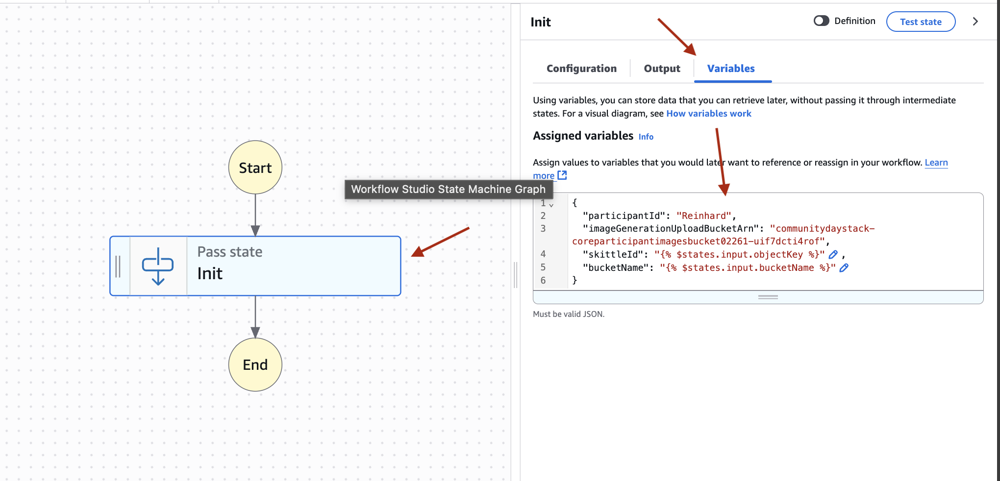

  - Replace `"participantId"` with your name/alias.  
     > ℹ️ This will be shown when your classification results are published.  

   Why this matters: these variables can be reused in later steps, so you don’t have to pass them around manually.

- Configure permissions of the Step Function:
  - Go to **Config**
  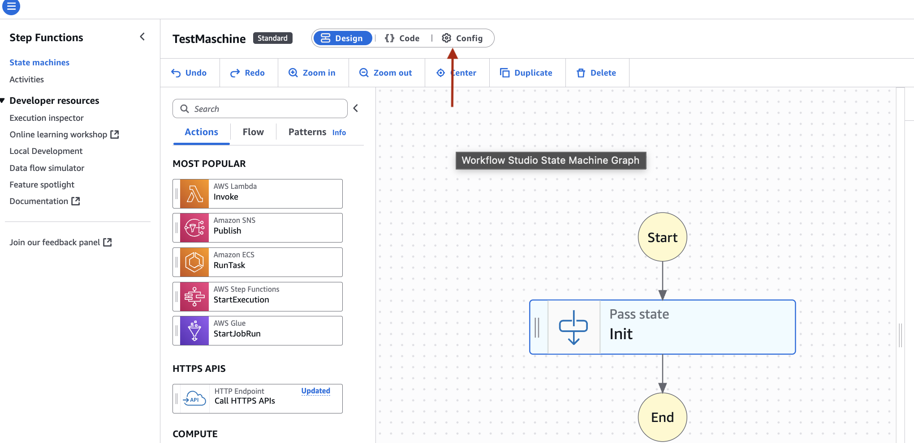
  - Then under **Permissions** → **Execution Role** → `CommunityDayStepfunctionRole`  
  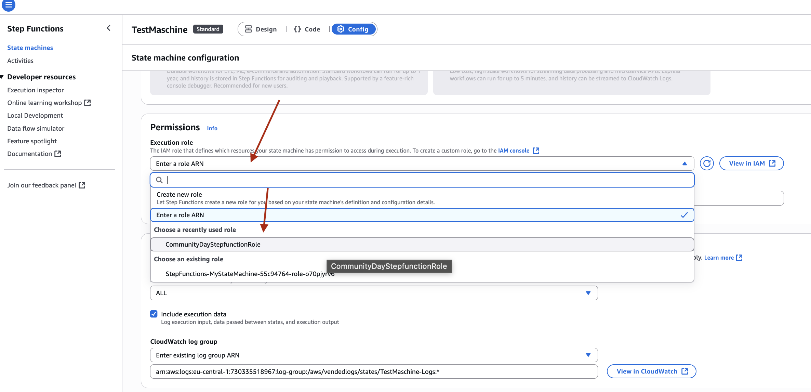
  - **Logging** → `ALL`

- Click **Create** in the top right corner to save your setup.
- After that you can click on **Execute** in the top right corner
- You can use these two inputs for testing your Stepfunctions with Images we preuploaded for testing purposes. The first one is an Image containing a red skittle and the second contains a non-skittle image.

  - Non-Skittle Image

    ```json

    {
      "bucketName": "communitydaystack-coreuploadbucket616431c4-nkuahhtimznp",
      "objectKey": "skittle-test.jpg"
    }

    ```

  - Non-Skittle Image

    ```json
    {
      "bucketName": "communitydaystack-coreuploadbucket616431c4-nkuahhtimznp",
      "objectKey": "non-skittle.jpg"
    }
    ```

  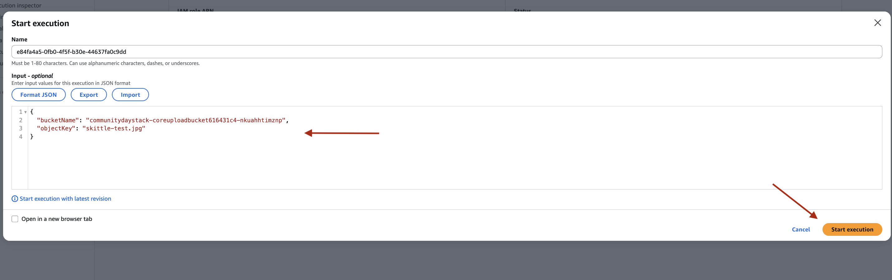
  
  - After executing the flow should finish successfully and you can discover the states inputs, outputs and the set variables. Right now its a very simple flow but for more complex configurations its a good way to debug and comprehend your stepfunction.

---

## Create the Image Classifier Lambda

Next we create a new Lambda. This Lambda loads the uploaded image from S3 and classifies whether it contains a Skittle (and its color).  

- Navigate to the Lambda Console
  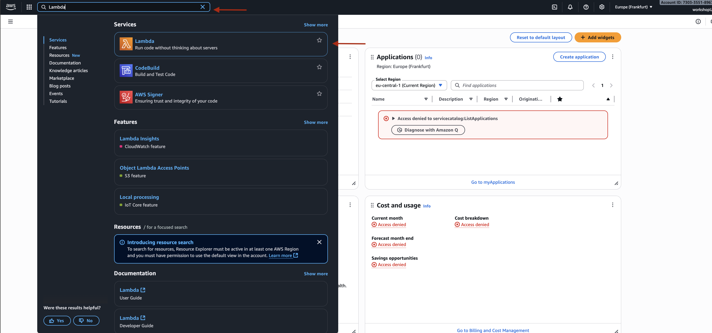
- In the Lambda Console click on `Create function`
- Create a Lambda with this config:  
  - Runtime: **Python 3.13**  
  - Architecture: **x86_64**  
  - Role: `CommunityDayLambdaRole`  
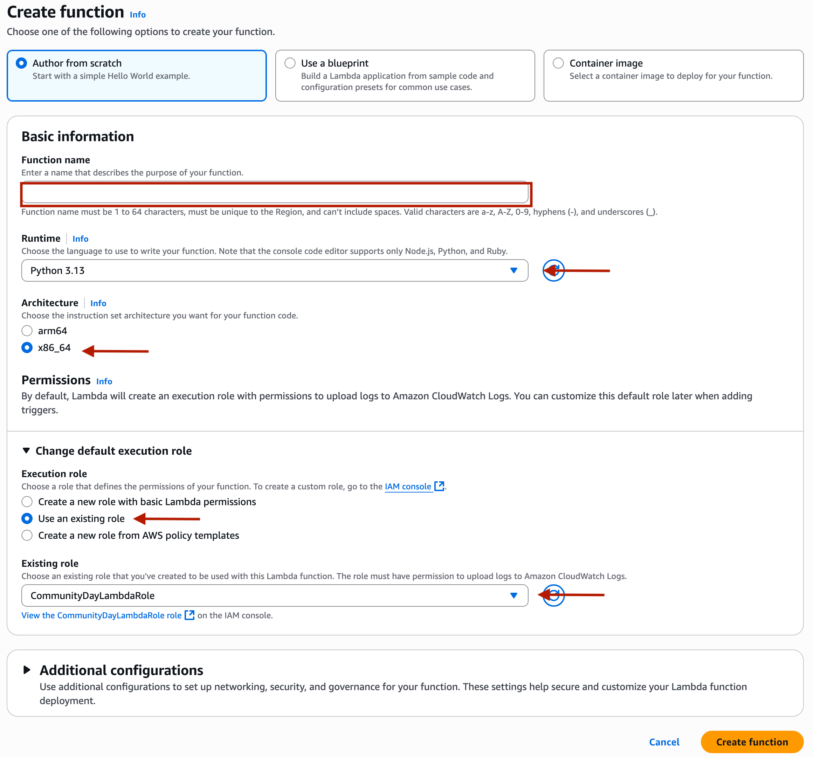
- Give your Lambda a name you can recognize and that allows you to find it again later. This is important since you are all using the same account and will see each others resources. Make sure you are not editing the resources of somebody else.

- Paste the classifier code into the editor.  

  ```python
  """Lambda handler that classifies Skittle images via Bedrock Claude 3.7."""

  from __future__ import annotations

  import base64
  import json
  import logging
  from typing import Any, Dict, Iterable, Optional, Tuple

  import boto3
  from botocore.exceptions import BotoCoreError, ClientError

  logger = logging.getLogger(__name__)
  logger.setLevel(logging.INFO)

  _DEFAULT_MODEL_ID = "anthropic.claude-3-haiku-20240307-v1:0"
  _ALLOWED_LABELS = (
      "red",
      "green",
      "yellow",
      "orange",
      "purple",
      "unknown",
  )

  _bedrock_client = boto3.client("bedrock-runtime")
  _s3_client = boto3.client("s3")

  def _load_s3_object_base64(bucket_name: str, object_key: str) -> Tuple[str, str]:
      try:
          response = _s3_client.get_object(Bucket=bucket_name, Key=object_key)
      except ClientError as exc:
          logger.error("Unable to fetch s3://%s/%s: %s", bucket_name, object_key, exc)
          raise

      body = response["Body"]
      try:
          data = body.read()
      finally:
          body.close()

      content_type = response.get("ContentType") or "image/jpeg"
      encoded = base64.b64encode(data).decode("utf-8")
      return encoded, content_type

  def _build_prompt_payload(image_base64: str, media_type: str) -> Dict[str, Any]:
      label_list = ", ".join(_ALLOWED_LABELS)
      instructions = (
          f"""You are an image classifier, that is part of a skittle sorting machine.
          Usually the images you get are of a single Skittle candy.
          If that's the case select the dominant candy color. If it is not a skittle write "unknown" as label.
          Respond with JSON only, structured as {{'label': <label>, 'reasoning': <short explanation>}}
          The label must be exactly one of: {label_list}"""
      )
      return {
          "anthropic_version": "bedrock-2023-05-31",
          "max_tokens": 512,
          "temperature": 0.0,
          "system": [{"type": "text", "text": instructions}],
          "messages": [
              {
                  "role": "user",
                  "content": [
                      {"type": "text", "text": "Classify the attached image using the allowed labels."},
                      {
                          "type": "image",
                          "source": {
                              "type": "base64",
                              "media_type": media_type,
                              "data": image_base64,
                          },
                      },
                  ],
              }
          ],
      }

  def _invoke_bedrock(body: Dict[str, Any]) -> Dict[str, Any]:
      try:
          response = _bedrock_client.invoke_model(
              modelId=_DEFAULT_MODEL_ID,
              accept="application/json",
              contentType="application/json",
              body=json.dumps(body),
          )
      except (ClientError, BotoCoreError) as exc:
          logger.error("Bedrock invocation failed: %s", exc)
          raise

      raw_body = response.get("body")
      payload_bytes = raw_body.read() if hasattr(raw_body, "read") else raw_body
      try:
          return json.loads(payload_bytes)
      except json.JSONDecodeError as exc:
          logger.error("Unable to parse Bedrock response body: %s", payload_bytes)
          raise RuntimeError("Bedrock response decoding error") from exc

  def _find_text_content(chunks: Iterable[Dict[str, Any]]) -> Optional[str]:
      for chunk in chunks:
          if chunk.get("type") == "text" and chunk.get("text"):
              text = str(chunk["text"]).strip()
              if text:
                  return text
      return None

  def _parse_classification(text: str) -> Dict[str, Any]:
      try:
          parsed = json.loads(text)
          if not isinstance(parsed, dict):
              raise ValueError("classification JSON must be an object")
      except (json.JSONDecodeError, ValueError):
          lower_text = text.lower()
          label = next((lbl for lbl in _ALLOWED_LABELS if lbl in lower_text), "unknown")
          return {"label": label, "reasoning": text}

      label = str(parsed.get("label", "")).strip().lower()
      if label not in _ALLOWED_LABELS:
          label = "unknown"

      reasoning = parsed.get("reasoning")
      if reasoning is not None:
          reasoning = str(reasoning)

      return {"label": label, "reasoning": reasoning}

  def _classify_image(image_base64: str, media_type: str) -> Dict[str, Any]:
      request_payload = _build_prompt_payload(image_base64, media_type)
      response_payload = _invoke_bedrock(request_payload)

      text_content = _find_text_content(response_payload.get("content", []))
      if not text_content:
          logger.error("Bedrock response missing text content: %s", response_payload)
          raise RuntimeError("Bedrock response missing text output")

      classification = _parse_classification(text_content)
      classification.setdefault("reasoning", text_content)
      return classification

  def lambda_handler(event: Dict[str, Any], _context: Any) -> Dict[str, Any]:
      object_key = event.get("objectKey")
      bucket_name = event.get("bucketName")
      logger.info("Classifying skittle image for object %s", object_key or "<unknown>")

      if not bucket_name or not object_key:
          raise ValueError("bucketName and objectKey are required in the event payload")

      data_b64, media_type = _load_s3_object_base64(bucket_name, object_key)
      classification = _classify_image(data_b64, media_type)
      return {"classification": classification}
  ```

- Click `Deploy` 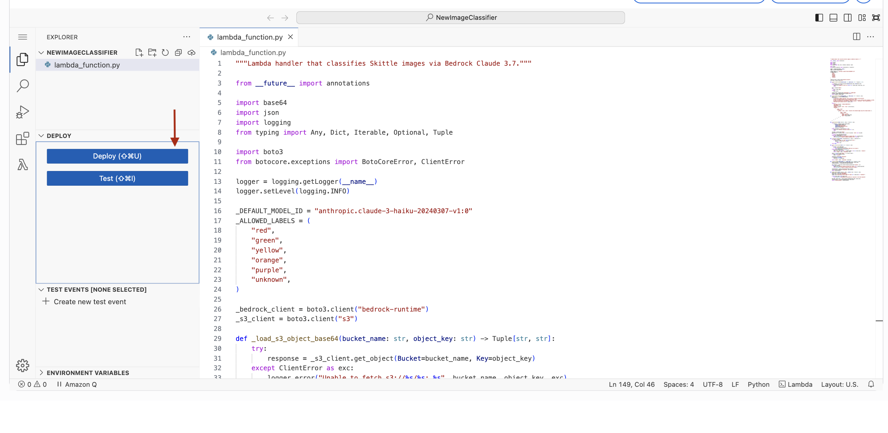
- Go to the `Configuration` tab and Configure the Lambda Timeout to 15 seconds.
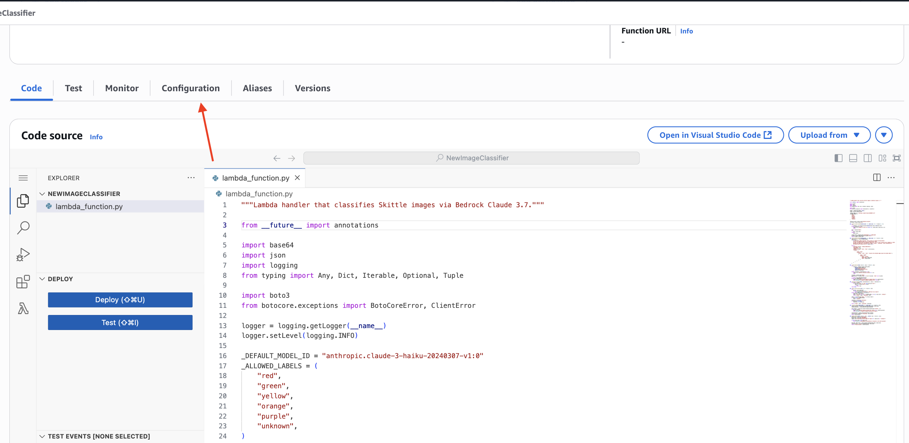
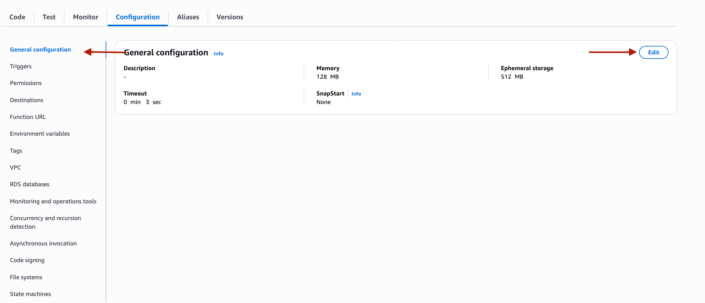
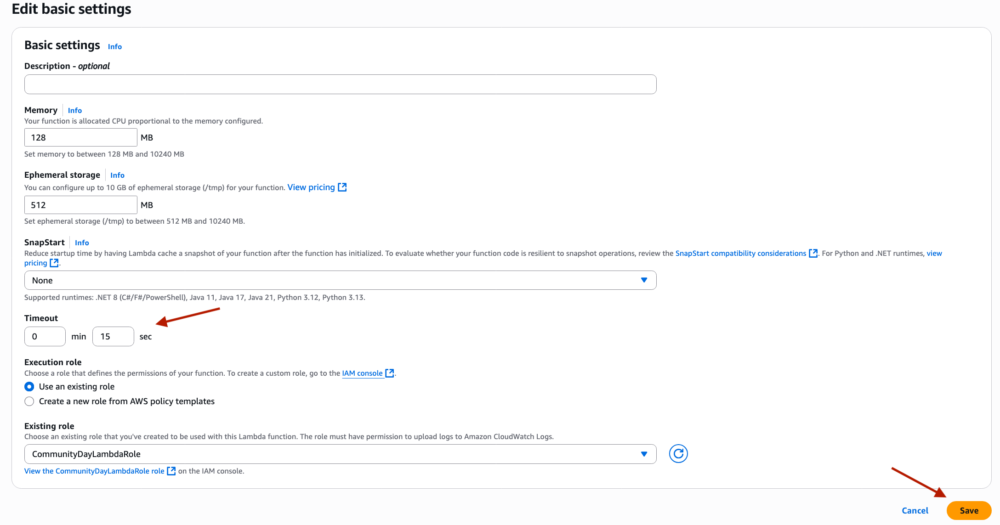

## Add the Classifier Lambda to the Step Function

- Add it to the Step Function:  
  - Edit your Stepfunction and drag an **AWS Lambda Invoke** state under **Init**.  
  - Name it **Classify Image**.  
  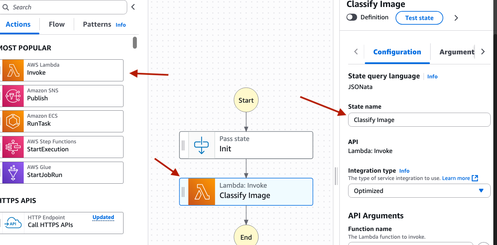
  - Select **your** classifier Lambda under **Function name**.  
  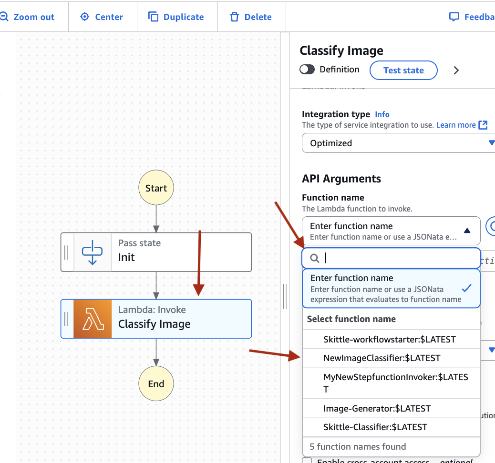

- Configure the payload by pasting in the json below:  

   ```json
   {
     "bucketName": "",
     "objectKey": ""
   }
    ```

- Save the classifier result as a variable, by navigating to the **Variables** tab and pasting this json:

     ```json
     {
       "classificationLabel": ""
     }
     ```

- Save the Step Function.

- Test by running the same event as before.

  - You should see the workflow go **Init → Classify Image**.
  - Click states to inspect inputs/outputs.

---

## Publish Results to SNS

Now we send the classification results back to the Skittle robot.

- Edit the Step Function → add **SNS Publish** as the final step.
  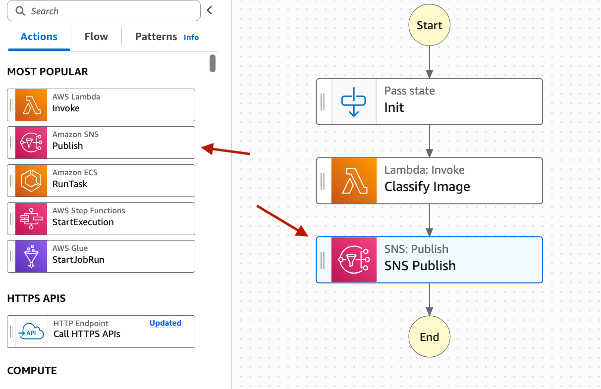
- Configure the Publish State:

  - For the **Topic ARN** set this value:
     `arn:aws:sns:eu-central-1:880707183272:workshop-skittle-result`
  - For the **Message** set:

     ```json
     {
       "skittleId": "",
       "participantId": "",
       "label": "",
       "generatedImageKey": ""
     }
     ```

- Save the Step Function. Ignore the warning about `generatedImageKey` not being defined yet, we will set that late. 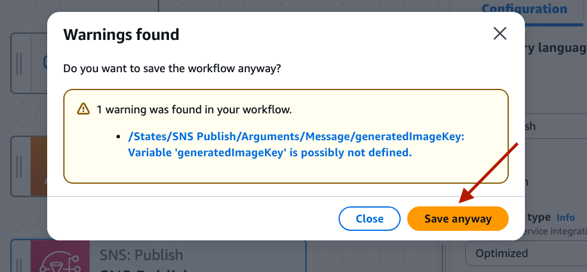

- Test again by re-running an execution. If successful, your result appears on the robot’s dashboard. 🎉

---

## Add Conditional Image Generation

Now we’ll extend the workflow to generate an image **only if** no valid Skittle was classified.

- Create the Image Generator Lambda
  - Go to the **Lambda Console** → **Create function**.  
  - In the Lambda Console click on `Create function`
  - Create a Lambda with this config:  
    - Runtime: **Python 3.13**  
    - Architecture: **x86_64**  
    - Role: `CommunityDayLambdaRole`  
  
  - Give your Lambda a name you can recognize and that allows you to find it again later. This is important since you are all using the same account and will see each others resources. Make sure you are not editing the resources of somebody else.

  - Paste the classifier code into the editor.  

    ```python
    """Lambda handler that generates consolation images via Bedrock Titan."""

    from __future__ import annotations

    import base64
    import json
    import logging
    import random
    from typing import Any, Dict, Iterable, Optional, Tuple
    from urllib.parse import quote

    import boto3
    from botocore.exceptions import BotoCoreError, ClientError

    logger = logging.getLogger(__name__)
    logger.setLevel(logging.INFO)

    _BEDROCK_REGION = "us-east-1"
    _TITAN_MODEL_ID = "amazon.titan-image-generator-v1"
    _CLAUDE_MODEL_ID = "anthropic.claude-3-haiku-20240307-v1:0"
    _PARTICIPANT_IMAGES_REGION = "eu-central-1"
    _PARTICIPANT_IMAGES_PREFIX = "participants/images"

    _BASE_PROMPT = (
        "A whimsical illustration of a person dramatically crying because there are no skittles left, "
        "bright colors, playful comic-book style, high detail, 4k, trending artstation"
    )

    _bedrock_client = boto3.client("bedrock-runtime", region_name=_BEDROCK_REGION)
    _s3_client = boto3.client("s3")


    def _compose_reference_prompt(event: Dict[str, Any]) -> str:
        object_key = event.get("objectKey")
        reasoning = (event.get("classification") or {}).get("reasoning")
        parts = [_BASE_PROMPT]
        if object_key:
            parts.append(f"Image reference: {object_key}.")
        if reasoning:
            parts.append(f"Original reasoning: {reasoning}.")
        return " ".join(parts)


    def _build_request_body(prompt: str, seed: int, width: int, height: int) -> Dict[str, Any]:
        return {
            "taskType": "TEXT_IMAGE",
            "textToImageParams": {"text": prompt},
            "imageGenerationConfig": {
                "numberOfImages": 1,
                "quality": "standard",
                "cfgScale": 8.0,
                "height": height,
                "width": width,
                "seed": seed,
            },
        }


    def _invoke_bedrock(body: Dict[str, Any]) -> Dict[str, Any]:
        try:
            response = _bedrock_client.invoke_model(
                modelId=_TITAN_MODEL_ID,
                accept="application/json",
                contentType="application/json",
                body=json.dumps(body),
            )
        except (ClientError, BotoCoreError) as exc:
            logger.error("Bedrock invocation failed for %s: %s", _TITAN_MODEL_ID, exc)
            raise

        payload = response.get("body")
        payload_bytes = payload.read() if hasattr(payload, "read") else payload
        try:
            return json.loads(payload_bytes)
        except json.JSONDecodeError as exc:
            logger.error("Unable to parse Bedrock response from %s: %s", _TITAN_MODEL_ID, payload_bytes)
            raise RuntimeError("Bedrock response decoding error") from exc


    def _extract_image_bytes(model_response: Dict[str, Any]) -> Tuple[bytes, str, str]:
        images = model_response.get("images")
        if not images:
            logger.error("Titan response missing images array: %s", model_response)
            raise RuntimeError("Titan response missing images")
        image_data = images[0]
        if not isinstance(image_data, str):
            raise RuntimeError("Titan image payload is not base64 text")
        try:
            image_bytes = base64.b64decode(image_data)
        except (ValueError, TypeError) as exc:
            raise RuntimeError("Unable to decode Titan image payload") from exc

        if image_bytes.startswith(b"\x89PNG\r\n\x1a\n"):
            extension = "png"
            content_type = "image/png"
        elif image_bytes.startswith(b"\xff\xd8\xff"):
            extension = "jpg"
            content_type = "image/jpeg"
        elif image_bytes.startswith(b"GIF87a") or image_bytes.startswith(b"GIF89a"):
            extension = "gif"
            content_type = "image/gif"
        else:
            extension = "bin"
            content_type = "application/octet-stream"

        return image_bytes, extension, content_type


    def _extract_text_content(chunks: Iterable[Dict[str, Any]]) -> Optional[str]:
        for chunk in chunks:
            if chunk.get("type") == "text" and chunk.get("text"):
                text = str(chunk["text"]).strip()
                if text:
                    return text
        return None


    def _generate_image_prompt(event: Dict[str, Any]) -> str:
        reference_prompt = _compose_reference_prompt(event)
        request_body = {
            "anthropic_version": "bedrock-2023-05-31",
            "max_tokens": 1024,
            "temperature": 0.8,
            "system": [
                {
                    "type": "text",
                    "text": (
                        """You craft imaginative yet concise prompts for the Titan image generator, by writing detailed image descriptions. 
                        The provided reference text is an example, think of you own image.
                        These Images are generated as result that there is no skittles. 
                        People Crying is therefore reasonable.
                        Return a single prompt sentence."""
                    ),
                }
            ],
            "messages": [
                {
                    "role": "user",
                    "content": [
                        {
                            "type": "text",
                            "text": (
                                "Reference prompt: " + reference_prompt +
                                """\nContext: Generate an image for someone disappointed by missing skittles.
                                The Image description should be funny"""
                            ),
                        }
                    ],
                }
            ],
        }

        try:
            response_payload = _invoke_bedrock(_CLAUDE_MODEL_ID, request_body)
            text = _extract_text_content(response_payload.get("content", []))
            if text:
                return text
            logger.warning("Claude response missing text content, using reference prompt")
        except Exception as exc:  # pylint: disable=broad-except
            logger.warning("Prompt generation failed (%s), falling back to reference", exc)
        return reference_prompt


    def _build_output_key(event: Dict[str, Any], seed: int, extension: str) -> str:
        base_key = str(event.get("objectKey") or "skittle").rsplit("/", 1)[-1]
        stem = base_key.rsplit(".", 1)[0]
        return f"{_PARTICIPANT_IMAGES_PREFIX}/{stem}-consolation-{seed}.{extension}"


    def _upload_image(bucket: str, key: str, image_bytes: bytes, content_type: str) -> None:
        _s3_client.put_object(
            Bucket=bucket,
            Key=key,
            Body=image_bytes,
            ContentType=content_type,
        )


    def _build_public_url(bucket: str, key: str, region: str) -> str:
        encoded_key = quote(key)
        return f"https://{bucket}.s3.{region}.amazonaws.com/{encoded_key}"


    def lambda_handler(event: Dict[str, Any], _context: Any) -> Dict[str, Any]:
        logger.info("Input event: %s", event)

        seed = random.randint(0, 2147483646)
        prompt = _generate_image_prompt(event)
        width = int(event.get("imageWidth", 512))
        height = int(event.get("imageHeight", 512))
        request_body = _build_request_body(prompt, seed, width, height)

        model_response = _invoke_bedrock(request_body)
        image_bytes, extension, content_type = _extract_image_bytes(model_response)

        key = _build_output_key(event, seed, extension)
        
        imageGenBucket = event.get("imageGenerationUploadBucket")

        _upload_image(imageGenBucket, key, image_bytes, content_type)
        url = _build_public_url(imageGenBucket, key, _PARTICIPANT_IMAGES_REGION)
        logger.info("Generated consolation image stored at s3://%s/%s", imageGenBucket, key)

        return {
                "generatedImageObjecturl": url,
                "generatedImageKey": key
          }
    ```

  - Click `Deploy` 
  - Go to the `Configuration` tab and Configure the Lambda Timeout to 15 seconds.
  
  
  

- Update the Step Function:

  - Insert a **Choice** state before **SNS Publish**.
  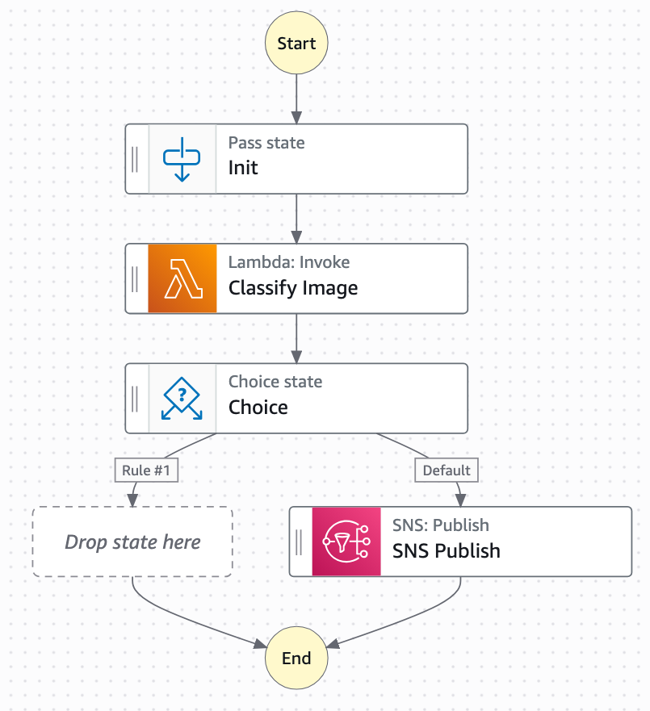
  - Name it **Is Valid Skittle**.

- Under Rule #1, add a **Lambda Invoke** state:
  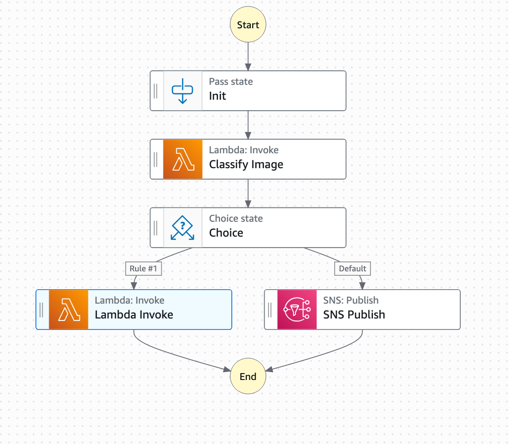
  - Name: **Generate Image**

  - Function: your image generation Lambda

  - Payload:

     ```json
     {
       "imageWidth": 512,
       "imageHeight": 512,
       "imageGenerationUploadBucket": ""
     }
     ```

  - Variables:

     ```json
     {
       "generatedImageUrl": "",
       "generatedImageKey": ""
     }
     ```

  - Go to "Configuration" → **Next state** → and set it to SNS Publish.

  - Click on the Choice state and Configure "Rule #1" by clicking on the pencil icon of the rule. Then set the rules condition to :

      ```text
      
      ```
  
  - Finally your stepfunction flow should look like this:
  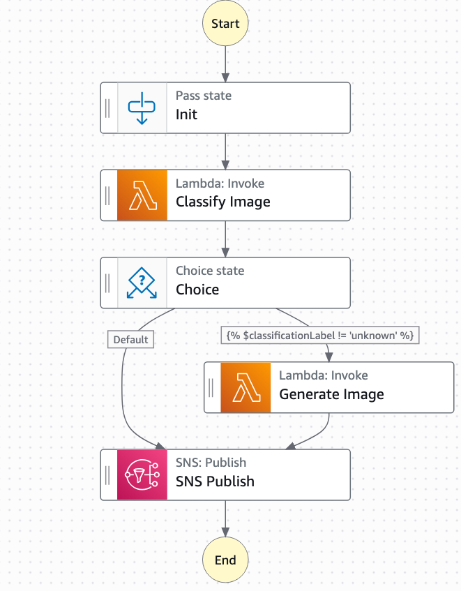
  - Save you stepfunction

---

Validate that everything works:

- run 2 executions, one for the skittle test image and one for the non skittle image and check if everything works without errors:

  - Non-Skittle Image

    ```json

    {
      "bucketName": "communitydaystack-coreuploadbucket616431c4-nkuahhtimznp",
      "objectKey": "skittle-test.jpg"
    }

    ```

  - Non-Skittle Image

    ```json
    {
      "bucketName": "communitydaystack-coreuploadbucket616431c4-nkuahhtimznp",
      "objectKey": "non-skittle.jpg"
    }

---

## Create the Lambda to Trigger the Step Function

The Final step is to add a Lambda that listens to SNS messages that are sent once the robot uploads a new image and starts the Step Function.

- Go to the **Lambda Console** → **Create function**.  
- In the Lambda Console click on `Create function`
- Create a Lambda with this config:  
  - Runtime: **Python 3.13**  
  - Architecture: **x86_64**  
  - Role: `CommunityDayLambdaRole`  


- Paste the classifier code into the editor.  

  ```python
  """SNS-triggered Lambda handler that starts a Step Functions workflow."""

  from __future__ import annotations

  import json
  import logging
  import os
  from typing import Any, Dict, List, Optional
  from urllib.parse import unquote_plus

  import boto3
  from botocore.exceptions import ClientError

  logger = logging.getLogger(__name__)
  logger.setLevel(logging.INFO)
  #TODO: Change the ARN to your Stepfunctions ARN!
  _STATE_MACHINE_ARN = ""

  _sfn_client = boto3.client("stepfunctions")


  def lambda_handler(event: Dict[str, Any], _context: Any) -> Dict[str, Any]:
      """Handle SNS notification for a new S3 object."""
      top_records = event.get("Records", [])
      logger.info("Received event: %s top-level record(s)", event)

      if not top_records:
          logger.warning("Event has no Records; nothing to do")
          return {"executionsStarted": []}

      # Find the first S3 record across all SNS records
      selected_record: Optional[Dict[str, Any]] = None
      for idx, sns_record in enumerate(top_records):
          sns = sns_record.get("Sns", {})
          topic_arn = sns.get("TopicArn")
          message_id = sns.get("MessageId")
          message = sns.get("Message")
          logger.info(
              "Inspecting SNS record %d: topicArn=%s messageId=%s hasMessage=%s",
              idx,
              topic_arn,
              message_id,
              bool(message),
          )

          if not message:
              continue

          try:
              payload = json.loads(message)
          except json.JSONDecodeError as exc:
              logger.warning("Skipping SNS record %d due to invalid JSON: %s", idx, exc)
              continue

          s3_records: List[Dict[str, Any]] = payload.get("Records", [])
          logger.info("SNS record %d contains %d S3 record(s)", idx, len(s3_records))
          if s3_records:
              selected_record = s3_records[0]
              logger.info("Selected first S3 record from SNS record %d", idx)
              break

      if not selected_record:
          logger.warning("No S3 records found across all SNS records; nothing to do")
          return {"executionsStarted": []}

      record = selected_record
      s3 = record.get("s3") or {}
      bucket = s3.get("bucket") or {}
      obj = s3.get("object") or {}

      bucket_name = bucket.get("name")
      object_key_raw = obj.get("key")

      if not (bucket_name and object_key_raw):
          logger.error(
              "First S3 record missing data: bucket_name=%s key=%s",
              bucket_name,
              object_key_raw,
          )
          return {"executionsStarted": []}

      object_key = unquote_plus(object_key_raw)
      object_uri = f"s3://{bucket_name}/{object_key}"
      sfn_input = {"bucketName": bucket_name, "objectKey": object_key}

      logger.info(
          "Starting Step Functions execution: stateMachineArn=%s input=%s for %s",
          _STATE_MACHINE_ARN,
          json.dumps(sfn_input),
          object_uri,
      )

      try:
          response = _sfn_client.start_execution(
              stateMachineArn=_STATE_MACHINE_ARN,
              input=json.dumps(sfn_input),
          )
      except ClientError as exc:
          logger.error("Failed to start Step Functions execution for %s: %s", object_uri, exc)
          raise

      execution_arn = response.get("executionArn")
      logger.info("Execution started successfully: executionArn=%s", execution_arn)

      return {"executionsStarted": [execution_arn] if execution_arn else []}

  ```
- **IMPORTANT** before deploying you need to copy the ARN of your stepfunction and set it to the value of the `_STATE_MACHINE_ARN` variable
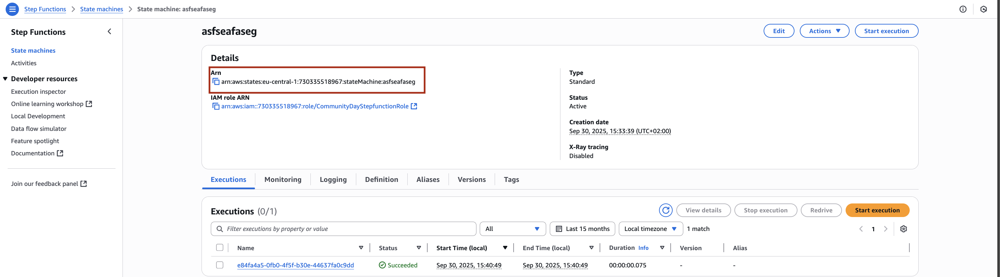
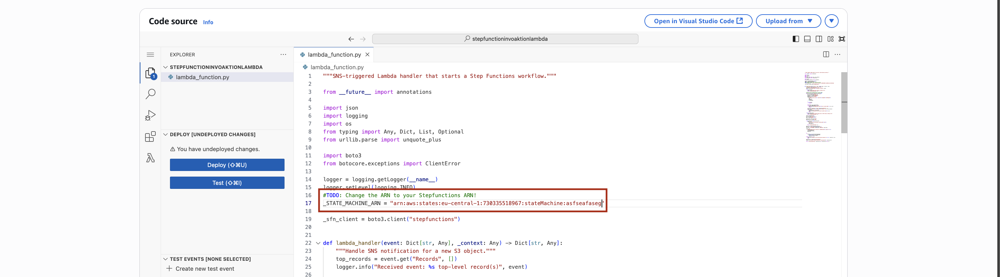

- Click `Deploy` 

- If you want you can test the Lambda with this event:

     ```json
     {
       "Records": [
         {
           "Sns": {
             "Message": "{\"Records\":[{\"s3\":{\"bucket\":{\"name\":\"communitydaystack-coreuploadbucket616431c4-nkuahhtimznp\"},\"object\":{\"key\":\"skittle-test.jpg\"}}}]}"
           }
         }
       ]
     }
     ```

- Add an **SNS trigger**: 
  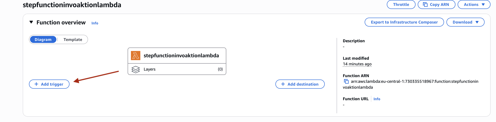
  - Source: **SNS**  
  - ARN: `arn:aws:sns:eu-central-1:880707183272:workshop-skittle`  

     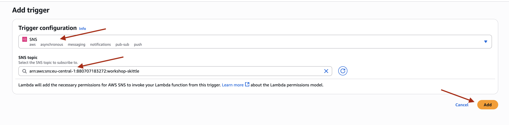

   ✅ Now, publishing to this topic will invoke your Lambda.  

  - Finally, check if triggering your lambda with the test event or when the robot uploads a new image your stepfunction is invoked and a new executions is added.

---

## 🎉 Wrap-Up

You now have a Step Function workflow that:

- Receives images via SNS/Lambda.
- Classifies them with a custom Lambda.
- Optionally generates an image.
- Publishes results to the Skittle robot.

---

## 🚀 Next Steps

- Modify the classifier prompt
- Modify the image generation to creat custom images
